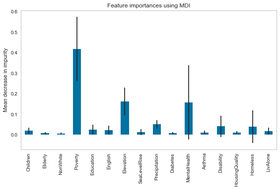
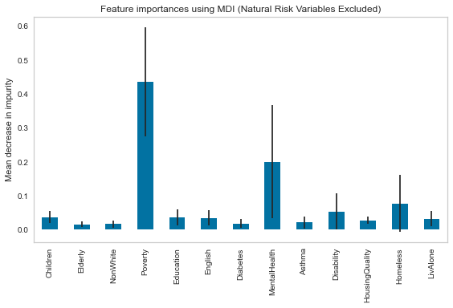

San Franciso Flood Health Index Analysis


```python
import os
from sklearn.model_selection import train_test_split
import matplotlib.pyplot as plt
import pandas as pd
from sklearn.ensemble import RandomForestRegressor
from sklearn.metrics import mean_squared_error
import numpy as np
from sklearn.linear_model import LinearRegression
from sklearn.cluster import KMeans
from yellowbrick.cluster import KElbowVisualizer
```


```python
os.chdir(r"..\Data")
rawdf=pd.read_csv("sf_flood_cleaned.csv")
```


```python
# K means clustering
X_Kmeans_df=rawdf[rawdf['FloodHealthIndex_Quintiles']>3]
X_Kmeans_df2=X_Kmeans_df.drop(['GEOID','FloodHealthIndex', 'FloodHealthIndex_Quintiles'],axis=1)

model = KMeans()
visualizer = KElbowVisualizer(model, k=(1, 11))
visualizer.fit(X_Kmeans_df2) # Fit the data to the visualizer
visualizer.show() # Finalize and render the figure
plt.show()

K = KMeans(n_clusters=3, random_state=0).fit(X_Kmeans_df2)
labels = K.labels_
X_Kmeans_df['K_means_labels']=labels
```


    

    


    C:\Users\TwoYoung\AppData\Local\Temp/ipykernel_73752/2970099312.py:13: SettingWithCopyWarning: 
    A value is trying to be set on a copy of a slice from a DataFrame.
    Try using .loc[row_indexer,col_indexer] = value instead
    
    See the caveats in the documentation: https://pandas.pydata.org/pandas-docs/stable/user_guide/indexing.html#returning-a-view-versus-a-copy
      X_Kmeans_df['K_means_labels']=labels
    


```python
# Similarity inside each cluster (RSD method)
for i in range(0,3):
    print ("The three variables with the lowest standard deviation within cluster " + str(i+1))
    cluster_df=X_Kmeans_df[X_Kmeans_df["K_means_labels"]==i]
    cluster_df=cluster_df.drop(['GEOID',"K_means_labels","FloodHealthIndex","FloodHealthIndex_Quintiles"],axis=1)
    stdlist=(cluster_df.std()/cluster_df.mean()).sort_values()[0:3]
    print(stdlist)
```

    The three variables with the lowest standard deviation within cluster 1
    Education    0.171376
    NonWhite     0.286607
    LivAlone     0.437901
    dtype: float64
    The three variables with the lowest standard deviation within cluster 2
    Education    0.095108
    Asthma       0.214300
    Poverty      0.249405
    dtype: float64
    The three variables with the lowest standard deviation within cluster 3
    Education    0.157829
    Elevation    0.282232
    NonWhite     0.293587
    dtype: float64
    


```python
#randomforest
print ("Fit a random forest model to use all variables to predict FHI")
X_df=rawdf.drop(['GEOID','FloodHealthIndex', 'FloodHealthIndex_Quintiles'],axis=1)
y_df=rawdf['FloodHealthIndex']

X_train,X_test,y_train,y_test = train_test_split(X_df, y_df, random_state=1991,test_size=0.3)

feature_names = [f"feature {i}" for i in range(X_df.shape[1])]
forest = RandomForestRegressor(random_state=0)
forest.fit(X_train, y_train)

score = forest.score(X_train, y_train)
print("R-squared:", score) 

y_pred = forest.predict(X_test)

mse = mean_squared_error(y_test, y_pred)
print("MSE: ", mse)
print("RMSE: ", mse*(1/2.0)) 

importances = forest.feature_importances_
std = np.std([tree.feature_importances_ for tree in forest.estimators_], axis=0)
forest_importances = pd.Series(importances, index=X_df.columns)
fig, ax = plt.subplots()
forest_importances.plot.bar(yerr=std, ax=ax)
ax.grid(False)
ax.set_title("Feature importances using MDI")
ax.set_ylabel("Mean decrease in impurity")
fig.tight_layout()
```

    Fit a random forest model to use all variables to predict FHI
    R-squared: 0.9878695545303472
    MSE:  13.00468551645133
    RMSE:  6.502342758225665
    


    

    


```python

#randomforest (exclude natural risks)
print ("Fit a random forest model to use non-natural exposure risk variables to predict FHI")
X_df=rawdf.drop(['GEOID','FloodHealthIndex', 'FloodHealthIndex_Quintiles','Elevation','SeaLevelRise','Precipitation'],axis=1)
y_df=rawdf['FloodHealthIndex']

X_train,X_test,y_train,y_test = train_test_split(X_df, y_df, random_state=1991,test_size=0.3)

feature_names = [f"feature {i}" for i in range(X_df.shape[1])]
forest = RandomForestRegressor(random_state=0)
forest.fit(X_train, y_train)

score = forest.score(X_train, y_train)
print("R-squared:", score) 

y_pred = forest.predict(X_test)

mse = mean_squared_error(y_test, y_pred)
print("MSE: ", mse)
print("RMSE: ", mse*(1/2.0)) 

importances = forest.feature_importances_
std = np.std([tree.feature_importances_ for tree in forest.estimators_], axis=0)
forest_importances = pd.Series(importances, index=X_df.columns)
fig, ax = plt.subplots()
forest_importances.plot.bar(yerr=std, ax=ax)
ax.grid(False)
ax.set_title("Feature importances using MDI (Natural Risk Variables Excluded)")
ax.set_ylabel("Mean decrease in impurity")
fig.tight_layout()

```

    Fit a random forest model to use non-natural exposure risk variables to predict FHI
    R-squared: 0.9724411300201653
    MSE:  31.69455334757252
    RMSE:  15.84727667378626
    


    

    


```python
#Correlation Between natural exposure risks and social-economic risks
corrdf=rawdf.drop(['GEOID','FloodHealthIndex', 'FloodHealthIndex_Quintiles'],axis=1)
corrlist=corrdf.corr()[['Elevation','SeaLevelRise','Precipitation']]
print(corrlist)
```

                    Elevation  SeaLevelRise  Precipitation
    Children         0.065316     -0.022899       0.046053
    Elderly          0.133456     -0.096542      -0.077409
    NonWhite        -0.134542      0.004747       0.081318
    Poverty         -0.336851      0.031763       0.053936
    Education        0.245580      0.015262      -0.071441
    English         -0.137102     -0.072985       0.023682
    Elevation        1.000000     -0.258823      -0.228096
    SeaLevelRise    -0.258823      1.000000       0.077612
    Precipitation   -0.228096      0.077612       1.000000
    Diabetes        -0.318044      0.180725       0.100724
    MentalHealth    -0.427889      0.031402       0.122155
    Asthma          -0.373651     -0.000360       0.132927
    Disability      -0.167537     -0.004167       0.009450
    HousingQuality  -0.100058     -0.055827      -0.005631
    Homeless        -0.448023      0.253721       0.040768
    LivAlone        -0.237623      0.086178      -0.044279
    


```python
#Fit a linear regression to analyze the contributors to homeless rate
from statsmodels.api import OLS
X_df=rawdf.drop(['GEOID','FloodHealthIndex', 'FloodHealthIndex_Quintiles', 'Homeless'],axis=1)
y_df=rawdf['Homeless']
OLS(y_df,X_df).fit().summary()
```


<table class="simpletable">
<caption>OLS Regression Results</caption>
<tr>
  <th>Dep. Variable:</th>        <td>Homeless</td>     <th>  R-squared (uncentered):</th>      <td>   0.721</td> 
</tr>
<tr>
  <th>Model:</th>                   <td>OLS</td>       <th>  Adj. R-squared (uncentered):</th> <td>   0.713</td> 
</tr>
<tr>
  <th>Method:</th>             <td>Least Squares</td>  <th>  F-statistic:       </th>          <td>   96.85</td> 
</tr>
<tr>
  <th>Date:</th>             <td>Sun, 09 Oct 2022</td> <th>  Prob (F-statistic):</th>          <td>6.82e-145</td>
</tr>
<tr>
  <th>Time:</th>                 <td>10:47:08</td>     <th>  Log-Likelihood:    </th>          <td> -1609.4</td> 
</tr>
<tr>
  <th>No. Observations:</th>      <td>   578</td>      <th>  AIC:               </th>          <td>   3249.</td> 
</tr>
<tr>
  <th>Df Residuals:</th>          <td>   563</td>      <th>  BIC:               </th>          <td>   3314.</td> 
</tr>
<tr>
  <th>Df Model:</th>              <td>    15</td>      <th>                     </th>              <td> </td>    
</tr>
<tr>
  <th>Covariance Type:</th>      <td>nonrobust</td>    <th>                     </th>              <td> </td>    
</tr>
</table>
<table class="simpletable">
<tr>
         <td></td>           <th>coef</th>     <th>std err</th>      <th>t</th>      <th>P>|t|</th>  <th>[0.025</th>    <th>0.975]</th>  
</tr>
<tr>
  <th>Children</th>       <td>    3.5529</td> <td>    4.257</td> <td>    0.835</td> <td> 0.404</td> <td>   -4.808</td> <td>   11.914</td>
</tr>
<tr>
  <th>Elderly</th>        <td>  -21.7213</td> <td>    3.999</td> <td>   -5.431</td> <td> 0.000</td> <td>  -29.577</td> <td>  -13.866</td>
</tr>
<tr>
  <th>NonWhite</th>       <td>    6.3453</td> <td>    1.620</td> <td>    3.918</td> <td> 0.000</td> <td>    3.164</td> <td>    9.527</td>
</tr>
<tr>
  <th>Poverty</th>        <td>   -3.6523</td> <td>    2.362</td> <td>   -1.546</td> <td> 0.123</td> <td>   -8.291</td> <td>    0.987</td>
</tr>
<tr>
  <th>Education</th>      <td>   -2.0566</td> <td>    1.451</td> <td>   -1.418</td> <td> 0.157</td> <td>   -4.906</td> <td>    0.793</td>
</tr>
<tr>
  <th>English</th>        <td>   -3.4440</td> <td>    3.192</td> <td>   -1.079</td> <td> 0.281</td> <td>   -9.713</td> <td>    2.825</td>
</tr>
<tr>
  <th>Elevation</th>      <td>   -0.0122</td> <td>    0.002</td> <td>   -6.168</td> <td> 0.000</td> <td>   -0.016</td> <td>   -0.008</td>
</tr>
<tr>
  <th>SeaLevelRise</th>   <td>   19.2500</td> <td>    3.639</td> <td>    5.290</td> <td> 0.000</td> <td>   12.102</td> <td>   26.398</td>
</tr>
<tr>
  <th>Precipitation</th>  <td>  -34.5672</td> <td>   12.213</td> <td>   -2.830</td> <td> 0.005</td> <td>  -58.556</td> <td>  -10.578</td>
</tr>
<tr>
  <th>Diabetes</th>       <td>    0.0166</td> <td>    0.043</td> <td>    0.386</td> <td> 0.700</td> <td>   -0.068</td> <td>    0.101</td>
</tr>
<tr>
  <th>MentalHealth</th>   <td>   -0.1127</td> <td>    0.022</td> <td>   -5.216</td> <td> 0.000</td> <td>   -0.155</td> <td>   -0.070</td>
</tr>
<tr>
  <th>Asthma</th>         <td>    0.8637</td> <td>    0.106</td> <td>    8.147</td> <td> 0.000</td> <td>    0.655</td> <td>    1.072</td>
</tr>
<tr>
  <th>Disability</th>     <td>   33.2143</td> <td>    5.518</td> <td>    6.019</td> <td> 0.000</td> <td>   22.376</td> <td>   44.053</td>
</tr>
<tr>
  <th>HousingQuality</th> <td>    0.0203</td> <td>    0.022</td> <td>    0.934</td> <td> 0.351</td> <td>   -0.022</td> <td>    0.063</td>
</tr>
<tr>
  <th>LivAlone</th>       <td>    8.6179</td> <td>    2.391</td> <td>    3.604</td> <td> 0.000</td> <td>    3.921</td> <td>   13.315</td>
</tr>
</table>
<table class="simpletable">
<tr>
  <th>Omnibus:</th>       <td>96.946</td> <th>  Durbin-Watson:     </th> <td>   0.568</td>
</tr>
<tr>
  <th>Prob(Omnibus):</th> <td> 0.000</td> <th>  Jarque-Bera (JB):  </th> <td> 165.723</td>
</tr>
<tr>
  <th>Skew:</th>          <td> 1.017</td> <th>  Prob(JB):          </th> <td>1.03e-36</td>
</tr>
<tr>
  <th>Kurtosis:</th>      <td> 4.657</td> <th>  Cond. No.          </th> <td>1.21e+04</td>
</tr>
</table><br/><br/>Notes:<br/>[1] R² is computed without centering (uncentered) since the model does not contain a constant.<br/>[2] Standard Errors assume that the covariance matrix of the errors is correctly specified.<br/>[3] The condition number is large, 1.21e+04. This might indicate that there are<br/>strong multicollinearity or other numerical problems.


```python
#Home Price Correlation Test
homepricedf=pd.read_csv("sf_flood_homeprice.csv")
homepricedf=homepricedf.drop("GEOID_1",axis=1)
corrlist=homepricedf.corr()['Homeprice'].sort_values(ascending=False)
print(corrlist)
```

    Homeprice           1.000000
    Education           0.422538
    Elevation           0.146365
    Children            0.119885
    HousingQuality      0.006047
    LivAlone           -0.008320
    SeaLevelRise       -0.041808
    Elderly            -0.082608
    Precipitation      -0.121629
    MentalHealth       -0.241539
    Homeless           -0.248961
    Diabetes           -0.278461
    Asthma             -0.289851
    Disability         -0.303444
    English            -0.430062
    FloodHealthIndex   -0.453226
    NonWhite           -0.473929
    Poverty            -0.503403
    Name: Homeprice, dtype: float64
    


```python

```
